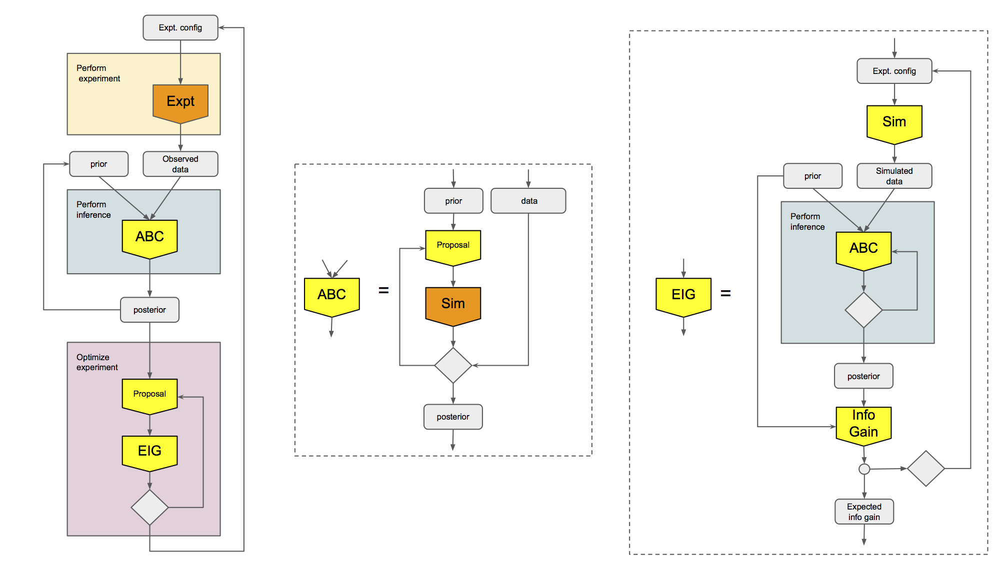

# "Active Sciencing" with Reusable Workflows

By Kyle Cranmer, Lukas Heinrich, Tim Head, Gilles Louppe

 | [Notebook Server](http://ycombdemo.cern.ch:30888/tree?) | [Physics simulator workflow](https://github.com/lukasheinrich/weinberg-exp/blob/master/README.md)

[](https://ycombdemo.cern.ch/submit?toplevel=github%3Alukasheinrich%2Fweinberg-exp%3Aexample_yadage&workflow=rootflow.yml&pars=%7B%22sqrtshalf%22%3A+45%2C+%22Gf%22%3A+1.76639e-05%2C+%22nevents%22%3A+10000%2C+%22seeds%22%3A+%5B1%2C+2%2C+3%2C+4%5D%2C+%22polbeam1%22%3A+0%2C+%22polbeam2%22%3A+0%2C+%22paramcardtempl%22%3A+%22param_card.templ%22%2C+%22runcardtempl%22%3A+%22run_card.templ%22%2C+%22proccardtempl%22%3A+%22sm_proc_card.templ%22%7D&archive=https%3A%2F%2Fraw.githubusercontent.com%2Flukasheinrich%2Fweinberg-exp%2Fmaster%2Fexample_yadage%2Finput.zip&outputs=merge%2Fout.jsonl)

Based on earlier work with NYU CDS masters students Manoj Kumar, Phil Yeres, and Michele Ceru and discussions with Brenden Lake and Gilles Louppe.

The point of this notebook is to explore the synergy of three powerful techniques:

   1. generic likelihood-free inference engines (eg. ABC, carl, etc.) that enable statistical inference on the parameters of a theory that are implicitly defined by a simulator
 
   2. workflows that encapsulate scientific pipelines and extend the scope from reproducibility to reusability
 
   1. active learning and sequential design algorithms (eg. Bayesian optimization) that balance exploration and exploitation to efficiently optimize an expensive black box objective function
 
Together, these three ideas can be combined to enable an efficient and automated loop of the scientific method -- at least, for a sufficiently well posed problem. The scientist's input to the system are:

 * an external workflow that implements some experimental protocol (orange **Exp** component)
 * an external workflow that implements a simulator for those experiments, which depends on some theoretical parameters that we would like to infer (orange **Sim** component).

 
Interesingly, we will use the simulator not only to perform inference on the parameters, but also to design the next experiment (this is where active learning comes in).

## Examples

 * [demo_gaussian.ipynb](demo_gaussian.ipynb) Runs a fast demo with a simple Gaussian simulator
 * [demo_weinberg.ipynb](demo_weinberg.ipynb) Runs a fast demo with an approximate physics-inspired simulation locally
 * [demo_weinberg_yadage.ipynb](demo_weinberg_yadage_full.ipynb) Runs a slower demo with an approximate physics-inspired simulation through a workflow system. This measures the [Weinberg angle](https://en.wikipedia.org/wiki/Weinberg_angle) in the standard model of particle physics.
 * [demo_weinberg_yadage_full.ipynb](demo_weinberg_yadage_full.ipynb) Runs a much slower demo with a [real Physics simulator workflow](https://github.com/lukasheinrich/weinberg-exp/blob/master/README.md). The [Physics simulator workflow](https://github.com/lukasheinrich/weinberg-exp/blob/master/README.md)
 * https://github.com/lukasheinrich/weinberg-exp/blob/master/README.md

